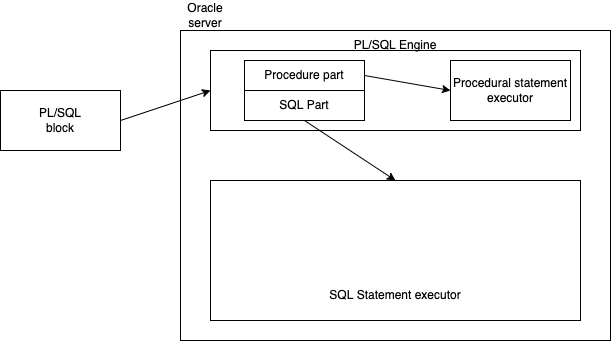

# PL/SQL

### Oracle's PL/SQL Architecture



- It is a code block
- Generally saved in the database as
  - Procedure
  - Function
  - Trigger
- All the stored PL/SQL blocks can also be grouped under a `package`
- Can also be written as an anonymous blocks
  - Not part of DB
  - Need to be saved in a file for future use

```sql
DECLARE
    -- declaring variables
BEGIN
    -- logic and SQL commands
[EXCEPTION
    -- logic to handle exceptions
]
END;
/
```

While learning PL/SQL, we often have to print out some text. The DBMS_OUTPUT package has a procedure called PUT_LINE that can be used to log our output. In production environment, this has not meaning, and must be avoided.

```sql
BEGIN
    DBMS_OUTPUT.PUT_LINE('hello, world!');
END;
/
```

Depending on the client used, the environment variable SERVEROUTPUT may be ON or OFF. Only when it is ON, there will be an output.

Example:

```sql
set SERVEROUTPUT ON;

BEGIN
    DBMS_OUTPUT.PUT_LINE('hello, there!');
END;
```

Using variable:

```sql
DECLARE
    v_message VARCHAR2(200);
BEGIN
    v_message := 'Hello, world!';
    DBMS_OUTPUT.PUT_LINE('The message is : ' || v_message);
END;
```

Basic exception handling example:

```sql
declare
    v_num1 number := 12;
    v_num2 number := 37;
    v_result number;
begin
    v_result := v_num1 / v_num2;
    dbms_output.put_line(v_num1 || '/' || v_num2 || ' = ' || v_result);

exception
    when ZERO_DIVIDE then
        dbms_output.put_line('Cannot divide a number by zero');
end;

```

### Data types in PL/SQL

- Scalar
  - variables of this type store only one value at a time
  - ex: number, varchar2, ...
- Composite
  - a variable of this type stores multiple values at the same time
  - ex: record, collection, ...

#### Scalar types

1. NUMBER
1. BOOLEAN
1. CHARACTER
1. DATETIME

## Declaring variables

- use a prefix to denote its scope:
  - `v_` for local variables
  - `p_` for parameters of procedures and functions
- While declaring, a value can also be assigned using the `:=` notation

## Anchored declarations

- borrowing the data type from other variables/coulmns of a table
- use the `%type` declaration

```sql
declare
    v_first_name employees.first_name%type;
    v_last_name employees.last_name%type;
    v_hire_date employees.hire_date%type;
    v_salary employees.salary%type;
begin
    select first_name, last_name, hire_date, salary
        into v_first_name, v_last_name, v_hire_date, v_salary
        from employees
        where employee_id = &EmployeeNumber;

    dbms_output.put_line('Name : ' || v_first_name || ' ' || v_last_name);
    dbms_output.put_line('Date of join: ' || v_hire_date);
    dbms_output.put_line('Salary: $' || v_salary);
end;
```

### Using `if` conditions

```sql
----
-- for a given employee, we want to display a grade based on salary
-- if the salary > the average salary in their department, then the grade is "A"
-- else it is "B"

declare
    v_first_name employees.first_name%type;
    v_last_name employees.last_name%type;
    v_salary employees.salary%type;
    v_department_id employees.department_id%type;
    v_avg_salary v_salary%type;
    v_grade char(1) := 'B';
begin
    select first_name, last_name, salary, department_id
        into v_first_name, v_last_name, v_salary, v_department_id
        from employees where employee_id = &EmployeeNumber;

    select avg(salary) into v_avg_salary
        from employees where department_id = v_department_id;

    if v_salary > v_avg_salary then
        v_grade := 'A';
    end if;

    dbms_output.put_line('Salary is $' || v_salary);
    dbms_output.put_line('Avg salary is $' || v_avg_salary);
    dbms_output.put_line('Grade of ' || v_first_name || ' ' ||
        v_last_name || ' is ' || v_grade);
end;
```

### Using `if-elsif-else` conditionals

```sql

/*
Modify the above code to produce 4 grades: A, B, C and D such that

salary > avg_salary * 150% --> A
salary between avg_salary and 150% of avg_salary --> B
salary between 50% of avg_salry and avg_salary --> C
else --> D
*/


declare
    v_first_name employees.first_name%type;
    v_last_name employees.last_name%type;
    v_salary employees.salary%type;
    v_department_id employees.department_id%type;
    v_avg_salary v_salary%type;
    v_grade char(1) := 'B';
begin
    select first_name, last_name, salary, department_id
        into v_first_name, v_last_name, v_salary, v_department_id
        from employees where employee_id = &EmployeeNumber;

    select avg(salary) into v_avg_salary
        from employees where department_id = v_department_id;

    if v_salary > (v_avg_salary*1.5) then
        v_grade := 'A';
    elsif v_salary > v_avg_salary then
        v_grade := 'B';
    elsif v_salary > (v_avg_salary*.5) then
        v_grade := 'C';
    else
        v_grade := 'D';
    end if;

    dbms_output.put_line('Salary is $' || v_salary);
    dbms_output.put_line('Avg salary is $' || v_avg_salary);
    dbms_output.put_line('Grade of ' || v_first_name || ' ' ||
        v_last_name || ' is ' || v_grade);
end;

```
