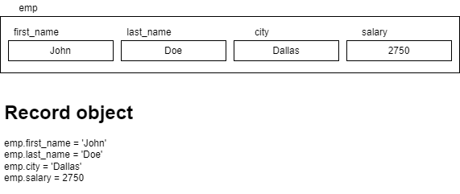

# Records, Exception handling and Cursors in PL/SQL

## Records

- Composite types
- One record consists of multiple fields, having their own values
- 
- Types:

  - Table based record

    - `%rowtype`
    - emp employees%rowtype; -- emp consists of one field for each column of the employees table, with the same names
    - For example, emp.employee_id, emp.first_name, emp.last_name and so on.
    - We can directly inject all columns (i.e, `*`) into the this type of variable
    - For example `select * into emp from employees where employee_id = 100`
    - This statement is not correct: `select first_name, last_name into emp from employees where employee_id=100`;

      - error: PL/SQL: ORA-00913: too many values

  - Programmer defined record

    - Two steps:

    1. define a recrod type (using the TYPE statement) and
    2. to create a record variable using the type defined

    - Syntax:

    ```sql
    TYPE record_type_name IS RECORD (
        field_name_1 data_type_1 [NOT NULL] [{:=default_value}{DEFAULT default_value}]
        [, ...]
    );
    ```

    - Example:

    ```sql
        TYPE employee_record IS RECORD (
            first_name employees.first_name%type,
            last_name employees.last_name%type,
            email employees.email%type,
            salary employees.salary%type
        );

        emp employee_record;

        --...

        SELECT first_name, last_name, email, salary
            into emp
            from employees
            where employee_id = 100;
    ```

    - The sequence of SELECT_LIST in the SELECT command must match the sequence of fields.

## Exception handling

- Errors that occur at the runtime
- Program breaks if the exception raised was not handled
- To handle, we create a section called `exception` and use a series of `when` conditions.
- Oracle defines error codes for every runtime error possible
  - some of them have names
    - NO_DATA_FOUND - ORA-01403
    - TOO_MANY_ROWS - ORA-01422
    - DUP_VAL_ON_INDEX - ORA-00001
    - INVALID_NUMBER
    - INVALID_CURSOR - ORA-01001
    - CURSOR_ALREADY_OPEN - ORA-06511
    - LOGIN_DENIED
    - STORAGE_ERROR
    - PROGRAM_ERROR
    - ZERO_DEVIDE - ORA-01476

```sql
declare
    emp employees%rowtype;
begin
    emp.employee_id := &employee_id;
    select * into emp
        from employees
        where employee_id = emp.employee_id;

    dbms_output.put_line(emp.first_name || ' earns $' || emp.salary);

exception
    when NO_DATA_FOUND then
        dbms_output.put_line('No data found for the employee id ' || emp.employee_id);
end;

```

## Cursors

- A pointer to a memory area (usually consisting of output of SELECT and DML commands)
- Types:
  - Implicit
    - created automatically, whenever Oracle executes `SELECT INTO`, `INSERT`, `UPDATE` or `DELETE` statements
    - Oracle handles the complete execution cycle of the above statements, and exposes only the cursor's information related to status
      - `SQL%ROWCOUNT`, `SQL%ISOPEN`, `SQL%FOUND` and `SQL%NOTFOUND`
  - Explicit
    - User defined variable that refers to a memory area consisting of result of a SQL SELECT statement.
    - Here the SELECT statemet is used inside the DECLARE section of a PL/SQL block (most of the times)
    - The SELECT statement does not include a INTO clause
    ```sql
    declare
        CURSOR cur_emp IS select * from employees where salary >= 10000;
    begin
        -- statements
    end;
    ```
    - The SELECT command is not executed during cursor creation
    - We must OPEN the cursor explicitly inside the BEGIN block, in order to execute the SQL SELECT statement
    ```sql
    BEGIN
        OPEN cur_emp; -- SQL associated with cur_emp is now sent to the SQL engine for fetching the data.
        -- The data fetched will be stored in a memory location, which is accessible to us using the cursor variable cur_emp.
    END;
    ```
    - Once the cursor is opened, then we can fetch one row at at time using the FETCH command
    ```sql
    DECLARE
        CURSOR cur_emp IS select * from employees where salary >= 10000;
        emp employees%rowtype;
    BEGIN
        OPEN cur_emp;
        FETCH cur_emp INTO emp; -- fetches / transfers the first row from the memory area into the variable emp
    END;
    ```
    - We use a loop to iterate over the cursor, and fetch rows one by one.
    - Use the `%FOUND` or `%NOTFOUND` attribute of the cursor to check if the FETCH command fetched any record or not
    - Once you have accessed all the rows from the cursor, it is customary to close the same
    ```sql
    CLOSE cur_emp;
    ```

Example of working with a CURSOR:

```sql

---- print the following information about employees earning more than $10000
--1. names and salries of all employees
--2. Total salary payout
--3. Average salary paid to all these employees
--4. No.of employees in this category
declare
    type emp_basic_type is record(
        fname employees.first_name%type,
        lname employees.last_name%type,
        salary employees.salary%type
    );
    cursor c1 is
        select first_name, last_name, salary
            from employees where salary > 10000;
    emp emp_basic_type;
    v_total_payout number:=0;
    v_avg_payout number;
begin
    open c1;

    loop
        fetch c1 into emp;
        exit when c1%notfound;

        v_total_payout := v_total_payout + emp.salary;
        dbms_output.put_line(emp.fname || ' ' || emp.lname || ' earns $' || emp.salary);
    end loop;
    dbms_output.put_line('No.of employees is ' || c1%rowcount);

    v_avg_payout := v_total_payout / c1%rowcount;
    dbms_output.put_line('Total payout    = $' || v_total_payout);
    dbms_output.put_line('Average payout  = $' || v_avg_payout);

    close c1;
exception
    when ZERO_DIVIDE then
        dbms_output.put_line('Nobody earns more than 230000');
end;
```

- c1%rowcount is increment each time the `FETCH c1` is executed.
- In other words, it represents the number of rows fetched from the cursor at a given point in time
