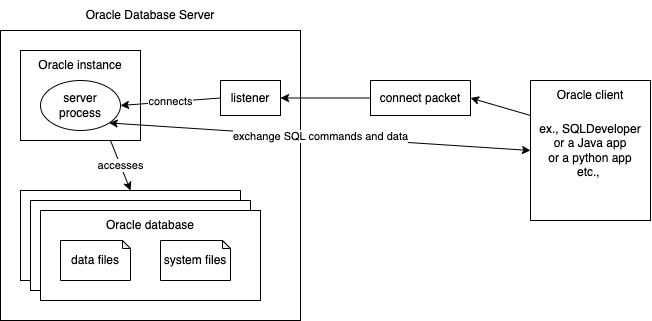
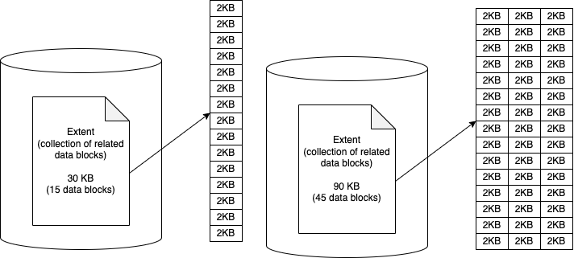
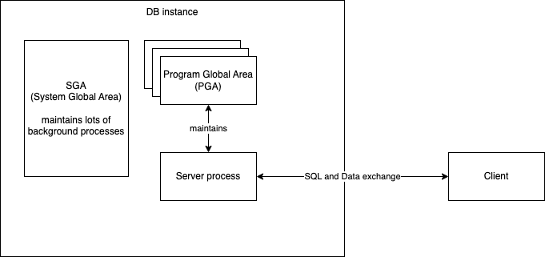

# Oracle database architecture



## Databases

- stores data
- physical storage structure is nothing but just files
    - data files: contain real data (tables, indexes, etc.)
    - control files: contain metadata (information about data) such as names and locations of database and data files
    - online redo log files: any change ever made to the data will be recorded over here

Apart from these, there are other files:
- password files
- backup files
- archive redo log files
- ADR (automatic diagnostic repository)

### Logical structure for data storage



- Data block: a number of bytes in the disk. Oracle always uses a data block to store data. Usually around 2KB.
- Data extent: a collection of logically related and continuous data blocks
- Segments: a set of extents allocated for storing database objects such as tables or indexes or views etc.,
- Tablespace: 
    - logical storage units that make up a database
    - logical container for a segment
    - must contain at least one data file


### DB Instance



#### major db background processes:

1. PMON (Process Monitor)
1. SMON (System Monitor)
1. DBWR (Db writer)
1. LGWR (Log writer)

# User management

## Creating a new user

Syntax:

```sql
CREATE USER {username}
    IDENTIFIED BY {password}
    [DEFAULT TABLESPACE {tablespace_name}]
    [QUOTA {size|UNLIMITED} ON {tablespace_name}]
    [PROFILE {profile_name}]
    [PASSWORD EXPIRE]
    [ACCOUNT {LOCK|UNLOCK}]
```

An  example:

```sql
-- LOGIN as sys or system
create user c##vinod identified by topsecret;
```

Here `c## `is a prefix to the username as mandated by the rules set by the DB administrator.

Once the user is created, the user may not able to connect, unless a `CREATE SESSION` privilege is granted.

```sql
GRANT CREATE SESSION TO c##vinod;
```

Other permissions include:

- CREATE TABLE
- CREATE VIEW
- CREATE PROCEDURE etc.,